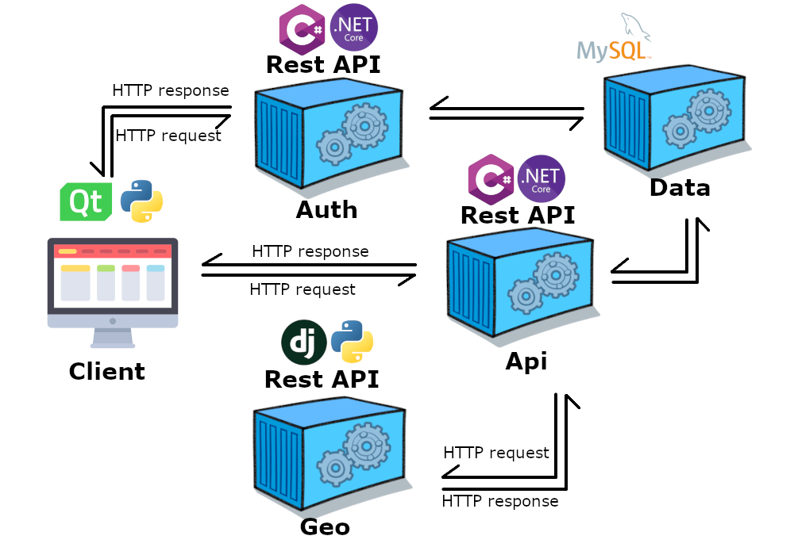

<hr>
<h6 align="center">
  <a href="https://docs.drawprogram.org">DrawCAD |</a>
  <a href="https://docs.drawprogram.org/doc">Doc |</a>
  <a href="https://docs.drawprogram.org/api">Api |</a>
  <a href="https://docs.drawprogram.org/geo">Geo |</a>
  <a href="https://docs.drawprogram.org/auth">Auth</a>
</h6>

<hr>

<p>
Geo service is a Django API project designed to perform geometric calculations with Python. There is no registration process in the service. It just makes calculations according to the request sent and returns the result. There is no need for token information to use the service. You can visit the <a href="https://docs.drawprogram.org/doc">doc</a> address for the queries you can make with the service.
</p>
<h3>Quick Start</h3>
<p>You can download the image from dockerhub to use it.</p>

```
docker pull mzahidberber/drawgeo:latest
```

<p>Or you can download the source code and create the image yourself.</p>

```
docker build -t drawgeo .
```

<p>
You can run it with Docker run. Allowed hosts and debug are not mandatory in environments. Even if you do not send the allowed hosts environment, it will run locally. Debug is false by default.
</p>

```
docker run --name geo -p 5001:5001 --env SECRET_KEY=<secretkey> --env ALLOWED_HOSTS=<ip> --env DEBUG=False drawgeo
```


